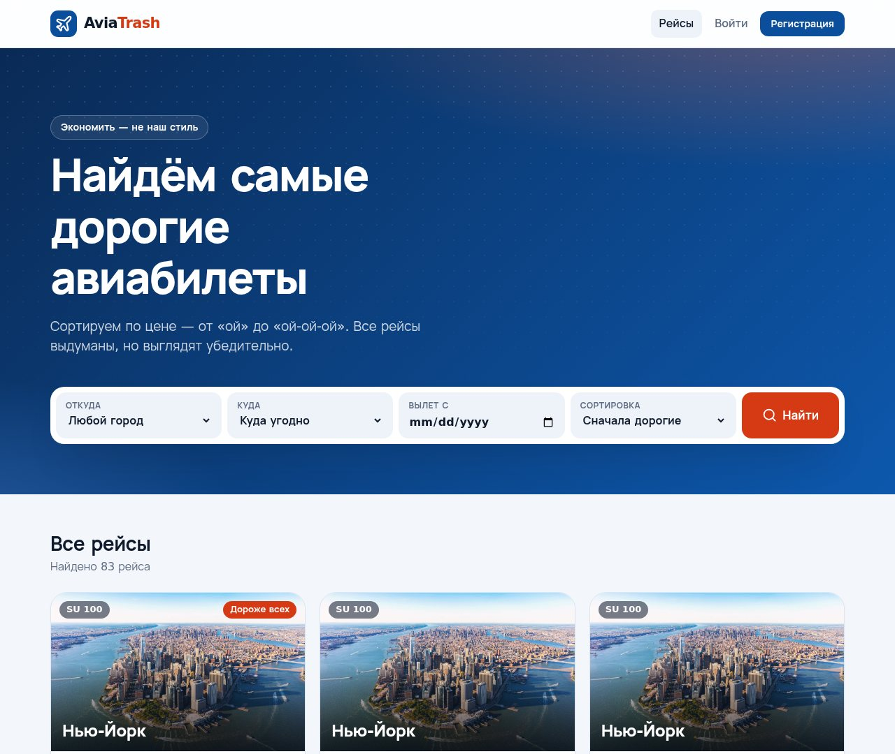
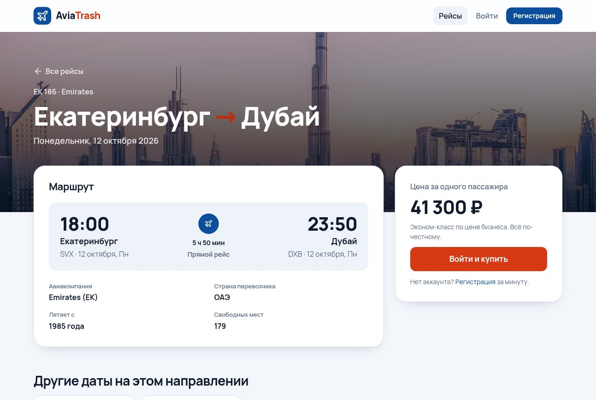
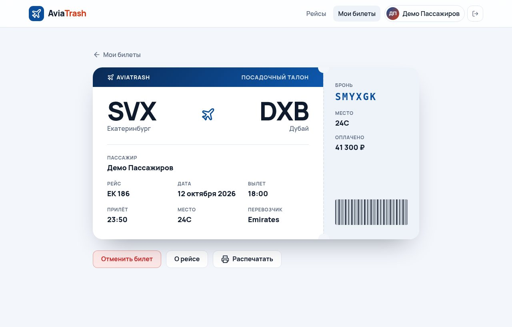
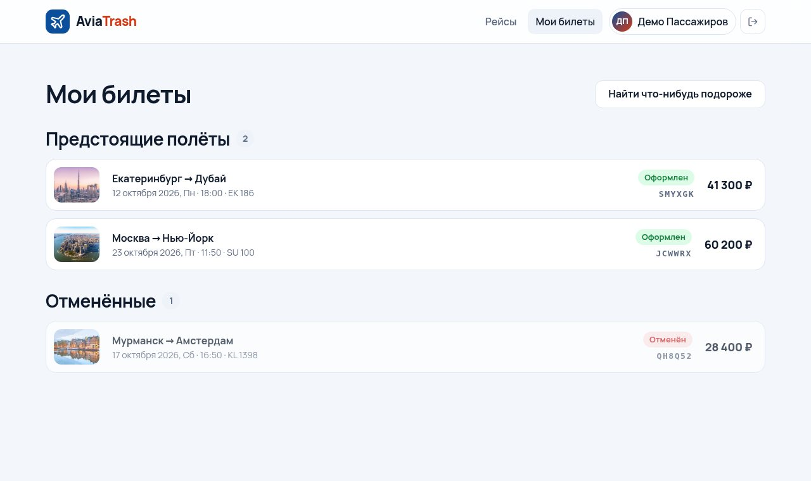
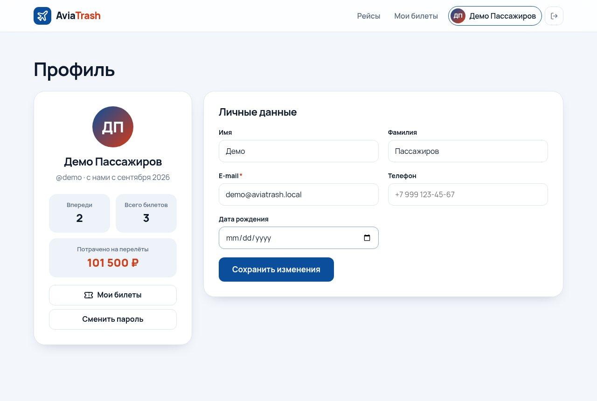
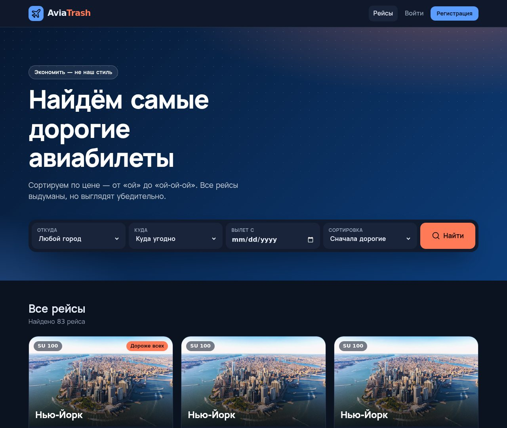
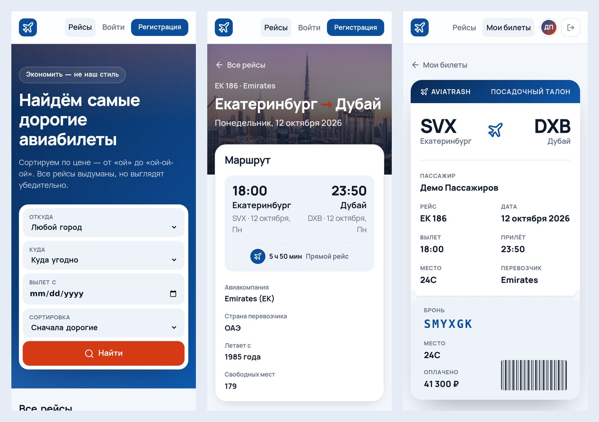

# ✈️ AviaTrash

**Поиск самых дорогих авиабилетов.** Шуточный пет-проект на Django: выдуманные рейсы, настоящие посадочные талоны и сортировка «сначала дорогие» по умолчанию. Экономить — не наш стиль.



## Что умеет

- **Поиск рейсов** — фильтры «откуда», «куда», «вылет с» и сортировка: сначала дорогие, дешёвые, по дате или по времени в полёте. Самый дорогой рейс в выдаче получает бейдж «Дороже всех».
- **Страница рейса** — маршрут с временем вылета и прилёта, длительность, пересадки, авиакомпания, количество свободных мест и другие даты на этом же направлении.
- **Покупка билета** — номер брони в формате PNR (`K7XQ2M`), случайное свободное место и фиксация цены на момент покупки. Повторная покупка не создаёт дубль, отменённый билет можно вернуть.
- **Посадочный талон** — отдельная страница для каждого билета: можно отменить или распечатать.
- **Мои билеты** — предстоящие, прошедшие и отменённые полёты.
- **Профиль** — личные данные, смена пароля и статистика: сколько полётов впереди и сколько денег потрачено.
- **Админка** — управление городами (с превью фото), авиакомпаниями, рейсами и билетами, поиск и фильтры.
- **Адаптивная вёрстка** и **тёмная тема**: подхватывается из настроек системы.

## Быстрый старт

Нужен **Python 3.12+**.

### Windows (PowerShell)

```powershell
git clone https://github.com/bordovichek/AviaTrash_MostExpensiveAirTickets.git
cd AviaTrash_MostExpensiveAirTickets

python -m venv .venv
.venv\Scripts\Activate.ps1
pip install -r requirements.txt

python manage.py migrate
python manage.py seed_demo
python manage.py runserver
```

> Если PowerShell ругается на запуск скриптов, один раз выполните
> `Set-ExecutionPolicy -Scope CurrentUser RemoteSigned` или активируйте окружение через `cmd`: `.venv\Scripts\activate.bat`.

### macOS / Linux

```bash
git clone https://github.com/bordovichek/AviaTrash_MostExpensiveAirTickets.git
cd AviaTrash_MostExpensiveAirTickets

python3 -m venv .venv
source .venv/bin/activate
pip install -r requirements.txt

python manage.py migrate
python manage.py seed_demo
python manage.py runserver
```

Сайт откроется на **http://127.0.0.1:8000/**.

### Демо-доступ

`seed_demo` создаёт пользователя **`demo` / `aviatrash`**: у него уже есть пара купленных билетов и один отменённый.

Для админки (`/admin/`) заведите суперпользователя:

```bash
python manage.py createsuperuser
```

## Полезные команды

| Команда | Что делает |
| --- | --- |
| `python manage.py seed_demo` | Города с фото, авиакомпании, расписание на 30 дней вперёд и демо-пользователь. Команду можно запускать повторно: дубли не появятся, добавятся только новые даты. |
| `python manage.py seed_demo --fresh` | Удаляет все рейсы и билеты и генерирует расписание заново от текущей даты. |
| `python manage.py test` | Запускает тесты (модели, сервисы, вьюхи, формы, команда наполнения). |
| `ruff check . && ruff format --check .` | Линтер и проверка форматирования (`pip install ruff`). |

Расписание строится относительно текущей даты, поэтому сайт не «протухает». Если рейсы закончились, выполните `seed_demo` ещё раз.

## Настройки

Значения по умолчанию подходят для локального запуска. Для прода задайте переменные окружения:

| Переменная | По умолчанию | Назначение |
| --- | --- | --- |
| `DJANGO_DEBUG` | `1` | Режим отладки. В проде — `0`. |
| `DJANGO_SECRET_KEY` | dev-ключ | Обязателен при `DJANGO_DEBUG=0`. |
| `DJANGO_ALLOWED_HOSTS` | `localhost,127.0.0.1,[::1]` | Список хостов через запятую. |
| `DJANGO_CSRF_TRUSTED_ORIGINS` | — | Например, `https://aviatrash.example.com`. |
| `DJANGO_DB_PATH` | `db.sqlite3` в корне | Путь к файлу SQLite. |

## Как устроено

```
.
├── config/                 # настройки, корневые urls, wsgi/asgi
├── aviaticket/             # рейсы и билеты
│   ├── models.py           # City, Airline, Flight, Ticket
│   ├── services.py         # покупка и отмена билета (бизнес-логика)
│   ├── forms.py            # форма поиска и сортировки
│   ├── views.py            # список, рейс, покупка, мои билеты, посадочный
│   ├── templatetags/avia.py  # |rub, |duration, |plural_ru, |transfers
│   ├── management/commands/seed_demo.py
│   └── seed/cities/        # фото городов для демо-данных
├── users/                  # кастомный User, регистрация, вход, профиль
├── templates/              # base.html, общие инклюды, 404
├── static/                 # CSS и иконка
└── docs/screenshots/
```

**Модели.** `Flight` ссылается на `City` дважды (откуда и куда) и на `Airline`. Время в пути хранится в `DurationField`, время прилёта вычисляется. `Ticket` связывает пассажира и рейс: на уровне БД стоит уникальность пары «пассажир + рейс» и есть проверки «город вылета ≠ город прилёта» и «длительность > 0».

**Бизнес-логика** вынесена из вьюх в `aviaticket/services.py`: вьюхи только принимают запрос, вызывают сервис и показывают сообщение.

**Маршруты:**

| URL | Страница |
| --- | --- |
| `/` | поиск и список рейсов |
| `/flights/<slug>/` | рейс, например `/flights/su-100-2026-10-23/` |
| `/flights/<slug>/buy/` | покупка (POST) |
| `/tickets/` | мои билеты |
| `/tickets/<PNR>/` | посадочный талон |
| `/tickets/<PNR>/cancel/` | отмена (POST) |
| `/account/login/`, `/account/register/`, `/account/profile/`, `/account/password/` | аккаунт |
| `/admin/` | админка |

## Стек

Django 5.2 LTS · SQLite · Pillow · чистые HTML и CSS без сборки и JS-фреймворков · ruff · GitHub Actions.

## Скриншоты

| Рейс | Посадочный талон |
| --- | --- |
|  |  |
| **Мои билеты** | **Профиль** |
|  |  |

**Тёмная тема**



**Телефон**



---

Проект не коммерческий и сделан для практики. Все совпадения случайны, все билеты выдуманы.
